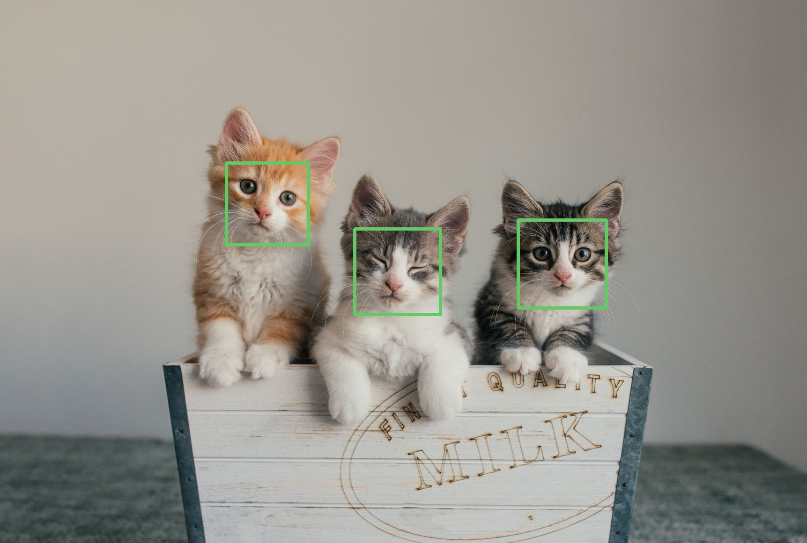

# 🐱 Cat Face Detection API using FastAPI

This project is a simple API built with **FastAPI**, **OpenCV**, and **NumPy** to detect cat faces in an uploaded image and return the image with bounding boxes around the detected faces.

---

## 📦 Requirements

Install the required dependencies using:

```bash
pip install fastapi uvicorn opencv-python numpy

> The io module is built into Python and does not need to be installed.


---

🚀 Running the Server

Start the FastAPI server with:

uvicorn main:app --reload

> Replace main with your actual Python file name if it's different.


---

📤 API Endpoint

POST /object_detection

Request:

Accepts an image PNG file uploaded as form-data with the key: input_file.

```

⚙️ How It Works

1. Receives an image file from the client.


2. Checks if the uploaded file is an image.

3. Reads and decodes the image using NumPy and OpenCV.

4. Detects cat faces using OpenCV’s Haar cascade:
haarcascade_frontalcatface.xml

5. Draws green rectangles around the detected faces.

6. Returns the processed image as a JPEG file.


